<!--
My immediate aim here is to generate an HTML document
suitable for copy-n-paste into Tweetdeck or Twitter.

I regard this as an initial step toward a full-fledged
output format for sciencey threads on Twitter.
-->

```{r setup, include=FALSE}
knitr::opts_chunk$set(echo = TRUE, out.width="400px")

# Together, this global counter plus 'tweet' chunk hook suffice to enable
# intercalating a Twitter 'commentary' thread within a larger html_document.
tweet_counter <- 0 # global counter
knitr::knit_hooks$set(tweet = function(before, options, envir){
  if (before) { # insert tweet text above any images
    tweet_counter <<- tweet_counter + 1
    tweet_numbering <- paste0(tweet_counter, "/")
    allotted <- 280 - nchar(tweet_numbering) - 1
    # TODO: Warn when---and by how much---a tweet exceeds character limit
    if (!is.null(options$link)) allotted <- allotted - 23*length(options$link)
    return(paste(paste(substr(paste(options$tweet, collapse="\n\n")
                             , 1, allotted)
                      , tweet_numbering)
                ,paste(options$link, collapse="\n\n")
                ,sep="\n\n"
                ))
  } else {
    return("\n\n---\n\n") # output an hline
  }
})
# For 'tweet' chunks, set echo=FALSE
knitr::opts_hooks$set(tweet = function(options) {
  options$echo <- FALSE
  options
})

# TODO: Consider whether an output hook will actually be needed,
#       if some amount of rendering gets done e.g. between $...$.
#       This is, after all, about 'sciencey' tweets, which are
#       inconceivable without math!
#       Note also that using *output* hooks would let me simply
#       'red' any character overages, a much more suitable way
#       to support drafting of threads.
# UHOH: BUT ... isn't this stuff that happens at PANDOC time?
#       Would I rather need a *pandoc* filter?
```

```{r tweet=c("New #rstats package #precautionary now on CRAN","\"The shaft of the arrow had been feathered with one of the eagle's own plumes. We often give our enemies the means of our own destruction.\"\n\n --- Aesop\n\n[THREAD]"), link="https://CRAN.R-project.org/package=precautionary"}
```


```{r tweet=c("By unifying several categories of dose-escalation design under a single simulation framework, @CatchTwentyToo's neat #escalation package has greatly facilitated the development of package #precautionary."), link="https://twitter.com/CatchTwentyToo/status/1229444639238873089"}
```


```{r tweet=c("My initial experiments toward #precautionary began by cloning his #escalation sourcecode, then --- following the plan I had intimated in a 2018 letter desk-rejected by @CCR_AACR --- \"changing just one line of simulation code\": https://pubpeer.com/publications/4CEB4434EA94CC0AA3BCAF63617A78#1")}
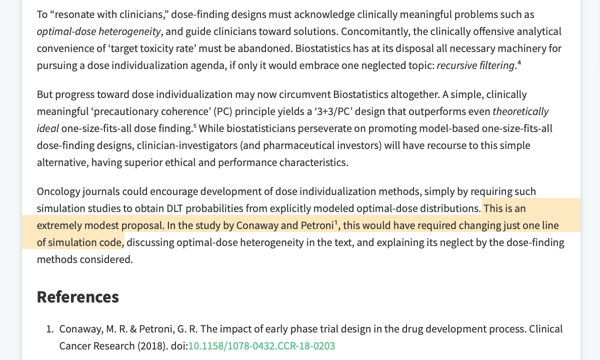
```


```{r tweet=c("The git diff (red=removed; green=added) show admittedly that I split the change across 2 lines of code:","• cohorts_of_n() now generates a uniform random variate $u_i \\sim \\mathscr{U}[0,1]$ for each enrolling patient","• phase1_sim() then refers to $u_i$ instead of calling rbinom().")}
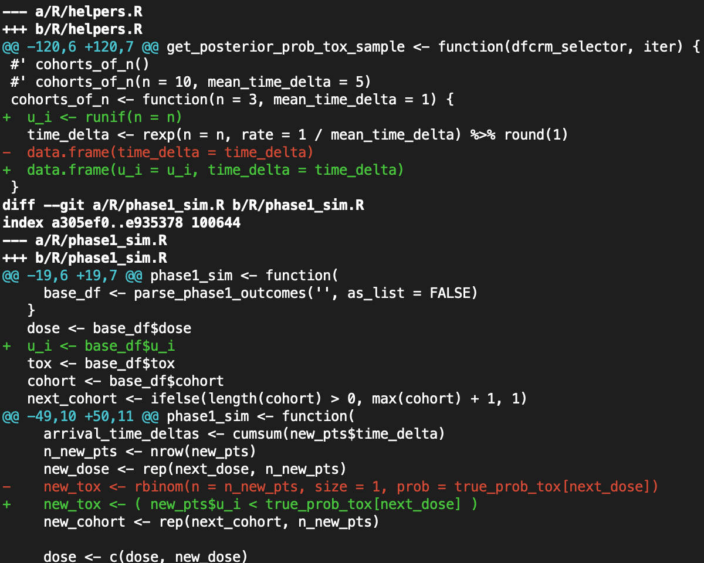
```


```{r tweet=c("In R, 'rbinom(size=1, prob=.)' generates a random Bernoulli (0/1) variate with the given prob of being a 1. Under the hood, this function almost surely works by","(a) drawing a uniformly distributed random number between 0 and 1, then","(b) comparing that against the given prob.")}
```


```{r tweet=c("Seen from a purely *software-engineering* POV, then, these are simple code transformations: we 'unwrapped' rbinom() to expose its inner workings, retaining u_i.","But this formal refactoring turns out to have *conceptual* correlates. Retaining $u_i$ makes a world of difference!")}
```


```{r tweet=c("Now $u_i$ has been on my radar for quite some time. I believe I've traced it back to its origins in the literature nearly 2 decades ago.", "From the look of things, the #OneSizeFitsAllogists knew from the outset how dangerous it could be."), link="https://twitter.com/davidcnorrismd/status/1271804500664365056"}
```


```{r tweet=c("What makes $u_i$ so dangerous is that it acknowledges a latent toxicity threshold characterizing an individual patient's susceptibility or tolerance to the drug's toxicity. This makes rbinom() a kind of Pandora's Box for the #OneSizeFitsAllogists ..."), link=c("https://commons.wikimedia.org/wiki/File:Pandora_-_John_William_Waterhouse.jpg")}

```


```{r tweet=c("What litany of ills, exactly, do we unleash by opening up rbinom()? You know how #DoctorWho villains are always going to destroy the fabric of the universe?","That's basically what u_i does."), link="https://twitter.com/TygerWhoCame2T/status/1251955542525968386"}
```


```{r tweet=c("Wait, though ... haven't the #OneSizeFitsAllogists shown that, even if someone destroys your universe, so long as you're not paying attention, your universe remains? https://twitter.com/davidcnorrismd/status/1244471654882750466")}
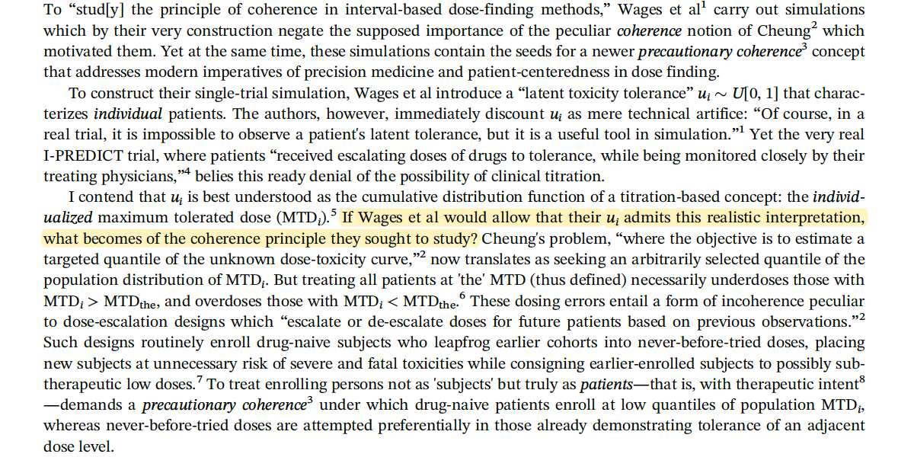
```


```{r tweet="Can't the #OneSizeFitsAllogists just cheat, ignore all norms of scholarship, and continue doing dose-escalation trials as if nothing has changed over the past 3 years?"}
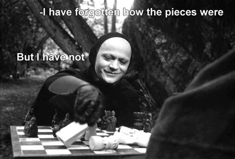
```


```{r tweet=c("THAT is the question package #precautionary seeks to answer. And the answer is NEGATIVE.","With #precautionary I show that, even if I let them take a big, whopping #Mulligan, they still have to confront devastating questions of TRIAL SAFETY.")}
```


```{r tweet=c("What kind of a Mulligan do we give them? The biggest one of all: letting them design a dose-escalation trial (i.e., instead of dose-#titration) to begin with!")}
```


```{r tweet=c("But why isn't that tantamount to surrender? Doesn't that give away the whole principle of inter-individual #heterogeneity in PKPD, forfeiting all of #DTAT's power?","Not if you left a $u_i$ lying around ...")}

```


```{r tweet=c("...or, more precisely, a $u_i$ for each patent in the simulation.","With these $u_i$'s, we can reconstitute the #DoseIndividualization argument right under the #OneSizeFitsAllogists' noses, in the very midst of one of their dose-escalation trials. We need only 1 further idea...")}
```


```{r tweet=c("#TherapeuticIndex (TI)",'In their 2012 @NatRevDrugDisc review, Muller & Milton advance TI as a fluid concept "that can be calculated using various pairs of pharmacological and toxicological end points."'), link="https://www.nature.com/articles/nrd3801"}
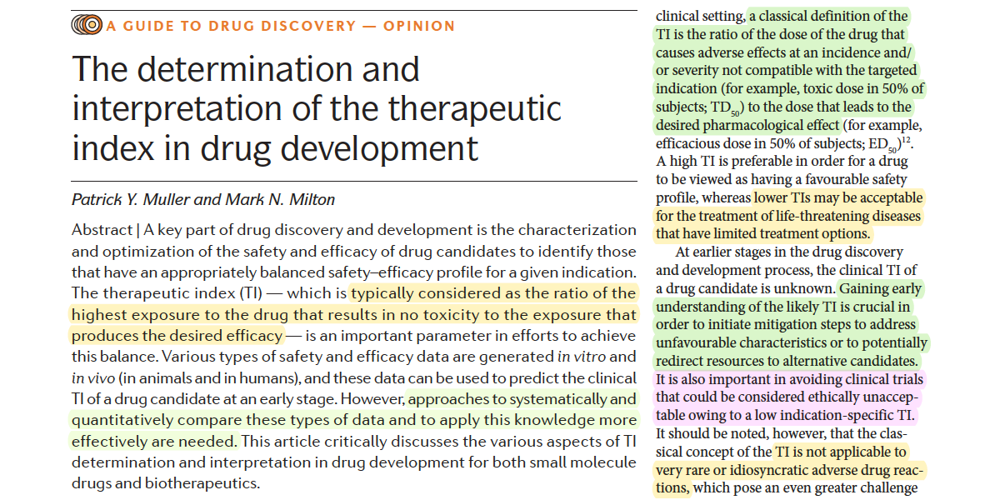
```


```{r tweet=c('Indeed, a running theme for them is that "knowledge about potential toxicities needs to be interpreted in relation to the desired pharmacology of the drug candidate, as well as the intended clinical indication, the associated unmet medical need & the competitive environment."')}
```


```{r tweet=c("In their short section on Oncology indications, Muller & Milton address the substantial toxicity of many oncology drugs in terms of a 'TI < 1'. But to my mind this inappropriately translates TI notions from other clinical applications.")}
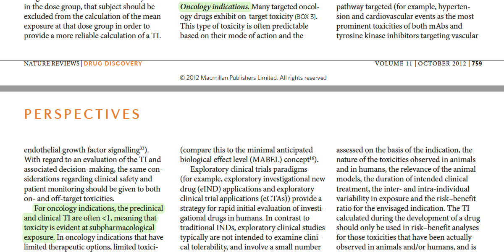
```


```{r tweet=c("If a #TherapeuticIndex ratio is to remain useful in a clinical context like oncology, where toxicity is expected and sometimes sought-after as a clinical correlate of on-target efficacy, then this ratio needs a less stringent numerator."), link="https://twitter.com/davidcnorrismd/status/1176114631951159296"}
```


```{r tweet=c("The CTCAE toxicity grading system already acknowledges this, I think. The numerator / denominator of an oncology-adapted TI ought to reference doses at which unacceptable / tolerable toxicities occur."), link="https://twitter.com/davidcnorrismd/status/1284451892224053250"}
```


```{r tweet=c("In terms of the MTD$_i^g$ notation I introduced in a recent @arXiv paper, this suggests a definition along the lines of:","TI$_i$ = MTD$_i^4$ / MTD$_i^3$,","the ratio of dose thresholds for Grade-4 vs Grade-3 toxicities."), link="https://twitter.com/davidcnorrismd/status/1255152628620840960"}
```


```{r tweet=c("I've let the subscript linger briefly on TI$_i$ to invite this consideration: In person-centered care TI is most properly a patient-specific concept. When you advise, \"I don't think this would be a good drug for you\", you're saying the patient's TI$_i$ is below or too near 1.")}
```


```{r tweet=c("The subscript on TI$_i$ also helps to reveal a close connection to the arXiv paper's $r_i$ --- a dose ratio that connects adjacent CTCAE toxicity grades.", link="https://twitter.com/davidcnorrismd/status/1255160313340723203")}
```


```{r tweet=c("(The idea of such a ratio is hardly outlandish. In fact, any scheme of dose reductions for toxicity---whether in a trial protocol or on an FDA label---implicitly contains such an intuition.)", link="https://twitter.com/davidcnorrismd/status/1204574163689586688")}
```


```{r tweet=c("For present purposes, tho, we may drop the $i$ subscript, since a population-average TI notion suffices. Thus, as in the arXiv paper, we write $r_0$ instead of $r_i$.","Now here's the deal: You posit an $r_0$; #precautionary simulates your trial's safety."), link="https://twitter.com/davidcnorrismd/status/1255165059807969287"}
```


```{r tweet=c("For line-by-line details of R commands, I refer you to the #precautionary package's Intro vignette https://cran.r-project.org/web/packages/precautionary/vignettes/Intro.html. But the basic outline is like this:","We start from where the #escalation package leaves off:")}
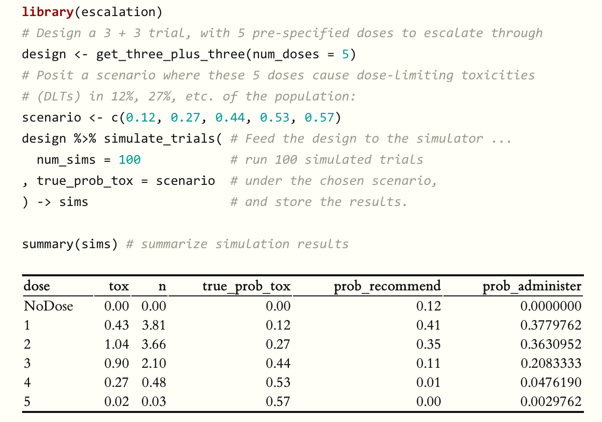
```


```{r tweet=c("First, instead of pulling a scenario of 'true toxicity probabilities' (or a 'skeleton' in CRM designs) out of thin air, we must refer it to a #realistic construct: an MTD$_i$ distribution. All you need to specify are the CV and median of the MTD:")}
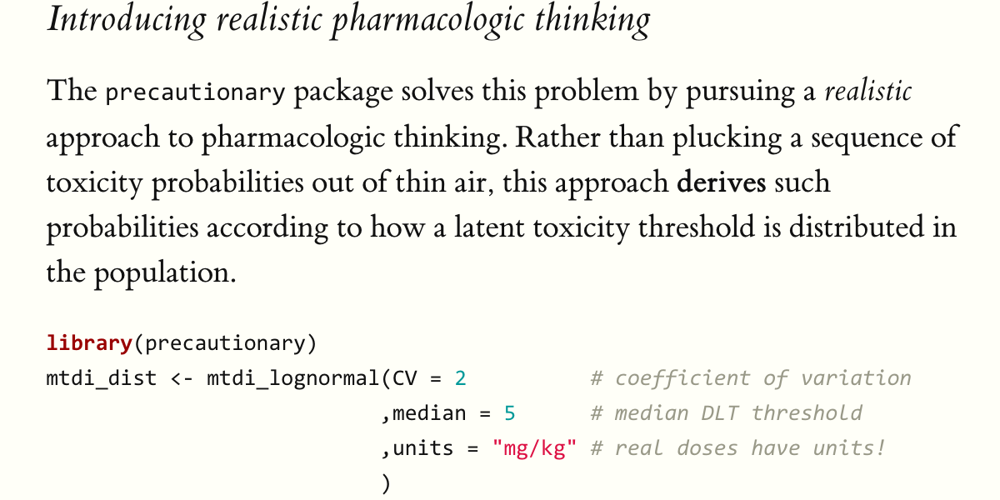
```


```{r tweet=c("Secondly, because #escalation works at a high level of abstraction, such that doses are merely labeled '1', '2', '3', ..., we have to specify the actual doses in our trial. (You were going to do this anyway; it's just that #precautionary cares to know.)")}
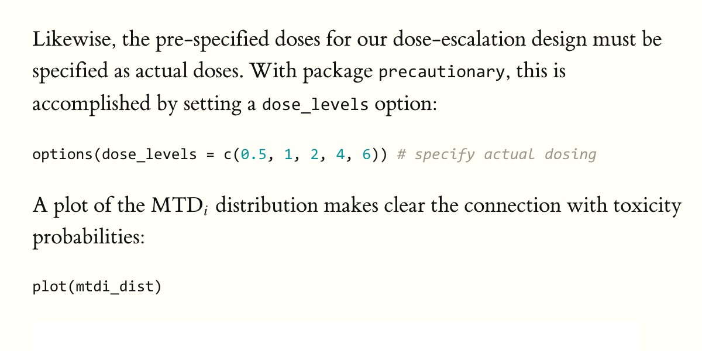
```


```{r tweet=c("(Having done this, we can see the 'true toxicity probabilities' scenario in context, through the dashed lines on an MTD$_i$ plot like this one.)")}
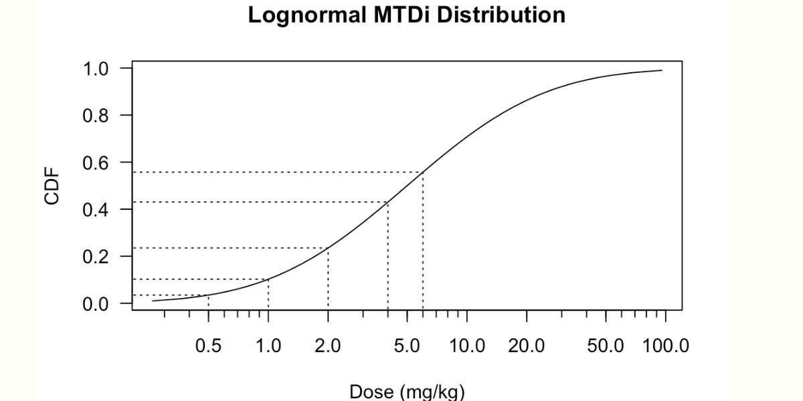
```


```{r tweet=c("Now, when we invoke the simulate_trials() method, #precautionary takes over---through the 'magic' of #rstats S4 classes.","In terms of the *output*, little has changed. But behind the scenes, SIMS now contains the u_i variable that #escalation's simulation output lacked.")}
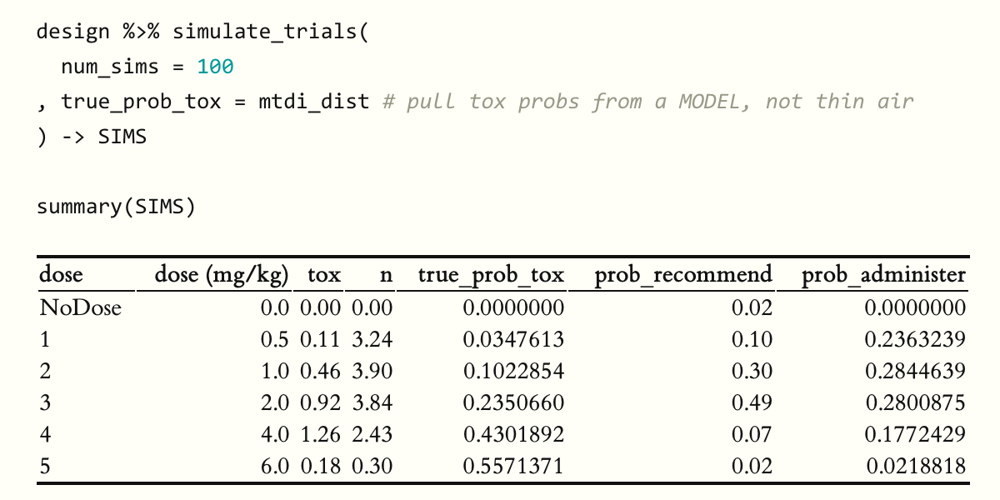
```


```{r tweet=c("Thus, we need only specify an 'ordinalizer'---with its $r_0$ parameter linking the dose thresholds across toxicity grades---to obtain a simulation with ordinal toxicities. This tells us about trial safety, via expected numbers of severe (Gr4) and fatal (Gr5) toxicities:")}
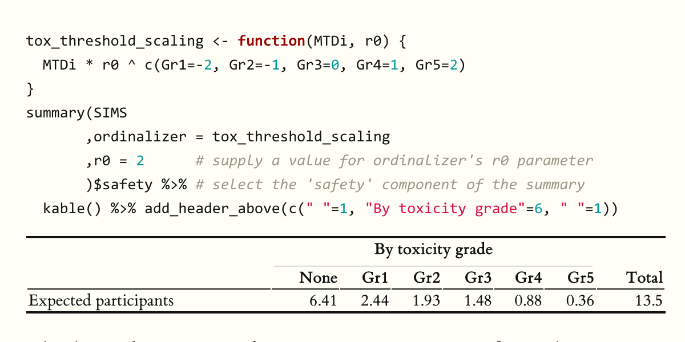
```


```{r tweet=c("But why do I present this as some kind of catastrophe for the #OneSizeFitsAllogists?","Because fatal toxicities in phase 1 oncology trials utterly discredit 1-size-fits-all #dosefinding, and its contempt for #PrecautionaryCoherence."), link="https://twitter.com/davidcnorrismd/status/1240299151067197443"}
```


```{r tweet=c("Only 2 weeks ago, @US_FDA put a clinical hold on a fatal CAR-T dose escalation.","And the abovementioned arXiv paper, where MTD$_i^g$ and $r_0$ emerged, was stimulated by severe & fatal toxicities in #AFM11 dose-escalation trials."), link=c("https://twitter.com/statnews/status/1280501925859950600","https://twitter.com/davidcnorrismd/status/1255120071648821249")}
```


```{r tweet=c("Surely @FDAOncology #prospectively reviews phase 1 trial designs under 21 CFR §312.42(b)(1)(i). These reviews could be more effective---and make trials #safer---if they took into view the #TherapeuticIndex considerations implemented in #precautionary."), link="https://twitter.com/davidcnorrismd/status/1264186764161363975"}
```


```{r tweet=c("In the final analysis, it is of course the physician-investigator who bears the ultimate responsibility for #trialsafety. My greatest hope is that package #precautionary helps trialists to think more realistically about #dosefinding designs, and to field safer trials.")}
```


```{r tweet=c("Of course, this is an INITIAL RELEASE: #precautionary v0.1-1. Much work remains, to test & extend the package, and to automate certain functionality. I hope to carry out most of this effort in collaborations on investigator-initiated trials. Investigators: email or DM me!")}
```


```{r tweet=c("I also ought to enlarge the #precautionary tent to subsume other R #dosefinding packages, e.g. #crmPack by @thomas_jaki &al.","And I would be delighted of course to foster a flow of #precautionary ideas into the dose-escalation mainstream."), link="https://twitter.com/thomas_jaki/status/1229462881898565632"}
```


```{r tweet=c("Looking ahead through whatever lingering life dose escalation still has left, I'll advance the following conjecture:","Suitable defaults can be found to enable semi-automated safety diagnostics for the majority of off-the-shelf dose-escalation designs."), }
```


```{r tweet=c("In closing, I thank @CatchTwentyToo for the clear and extensible foundation he provided in package #escalation. I must also say this encounter with the strong example of his R programming work has stimulated meaningful improvements to my own R programming practices.")}
```


```{r echo=TRUE}
library(escalation)
# Some code designing and simulating a trial...
```
